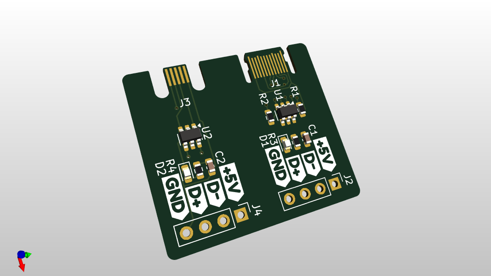
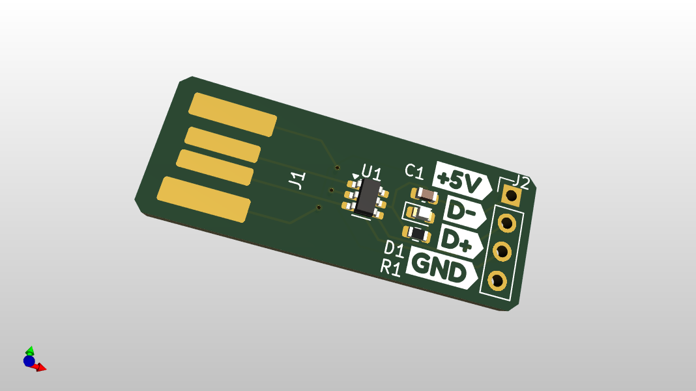

# PCB-Edge-USB-connector-KiCad-library
KiCad library for a bunch of PCB USB connectors:

- USB type C edge connector - include all 24 pins, no shield - use 0.6mm board thickness
- micro USB edge connector - include 5 pins, no shield - use 0.6mm board thickness
- USB type A edge connector - include 4 pins, no shield - use 2.0mm board thickness

## Demo boards
Also, there is a demo PCBs in the testboards folder 
- combined board for USB-C and microUSB connectors because of the same PCB thickness of 0.6mm

- testboard for USB type A (regular USB) edge PCB plug connector thickness 2.0mm

## Tips and tricks

- Use 0.6mm PCB thickness for USB type C and microUSB connectors
- Use 2.0mm PCB thickness for USB type A (regular USB) connector
- **Don't use HASL or any thick surface finish that could increase the PCB thickness - if you don't want to make your cable unusable.**
- The best option is to use ENIG surface finish.
- Play with the width of the cutout for the connector body to achieve the best results

## Why?

I know that PCB Edge is not the most reliable and useful USB connector. Still, in some cases then you need to make a simple and fast PCB, to test something without fixing connector soldering issues that could be the best option.

**The author is not responsible for any consequences of using that connector library - use it at your risk!**

## How to install and use this library

1. Download the .zip version of this repo
2. Open KiCad "Plugin and Content Manager"
3. Press the "Install from file" button at the bottom of this window
4. Choose the .zip file of this repo
5. Done, you should find this packet library in the "Installed" tab of the "Plugin and Content Manager"

Or you can install it manually unpacking symbol and footprint files in the system or project folders and setting up the correct paths.

To use the library find its components in the "PCM_Connector_USB_PCB_Edge" folder in the symbol manager. Footprints should be connected from the "PCM_" prefix footprint folder.

